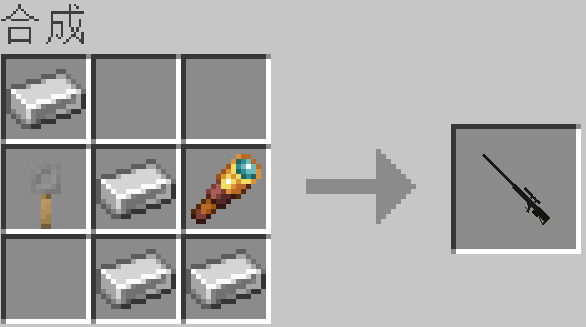

# 狙击枪模组 1.0-SNAPSHOT 说明文档

## 配置

by Jaffe2718

> ### 开发环境
> 
> | 项目         | 描述                         |
> | ---------- | -------------------------- |
> | JDK        | Java SE Development Kit 17 |
> | Gradle     | gradle-7.5.1               |
> | IDE        | Jetbrains IntelliJ         |
> | IDE插件 (可选) | Minecraft Development      |
> 
> ### 客户端运行环境
> 
> | 项目                     | 要求配置     | 推荐配置                           |
> | ---------------------- | -------- | ------------------------------ |
> | JDK                    | JDK 17   | Java SE Development Kit 17.0.6 |
> | Minecraft Java Edition | 1.19.x   | 1.19.2                         |
> | Fabric Loader          | >=0.14.9 | 0.14.13                        |
> | Fabric API             | >=0.60.0 | 0.72.0                         |
> | 启动器                    | 任意       | BakaXL                         |

## 使用方法

> ### 开发环境
> 
> 1. 克隆远程仓库的源码`git clone https://github.com/Jaffe2718/Fabric-Sniper-Rifle-1.19.2-MDK.git`
> 
> 2. 使用Jetbrains IntelliJ打开项目
> 
> 3. 加载Gradle任务，即可运行和调试项目。
> 
> ### Minecraft Java Edition 客户端
> 
> #### 安装配置
> 
> 1. 安装对应版本带有Fabric Loader的Minicraft
> 
> 2. 安装对应版本的 [Fabric API](https://www.mcmod.cn/class/3124.html)
> 
> 3. 安装模组 `sniperrifle-1.0-SNAPSHOT.jar`
> 
> #### 玩法说明
> 
> - 新增武器：栓动狙击步枪，消耗火药作为弹药，伤害20，耐久100。
> 
> - 使用方式：当未装填时，右键长按装填弹药，消耗1个火药；当已装填时，右键长按开镜，松开右键开火。
> 
> - 合成：合成栓动狙击步枪需要4个铁锭，1个望远镜，1个拌线钩，具体合成方式如下图
> 
> 

## 快捷链接

远程仓库    [Jaffe2718/Fabric-Sniper-Rifle-1.19.2-MDK ](https://github.com/Jaffe2718/Fabric-Sniper-Rifle-1.19.2-MDK)

Fabric API    [Fabric API - MC百科|最大的Minecraft中文MOD百科](https://www.mcmod.cn/class/3124.html)

Fabric WIKI    [start [Fabric Wiki] (fabricmc.net)](https://fabricmc.net/wiki/doku.php)
